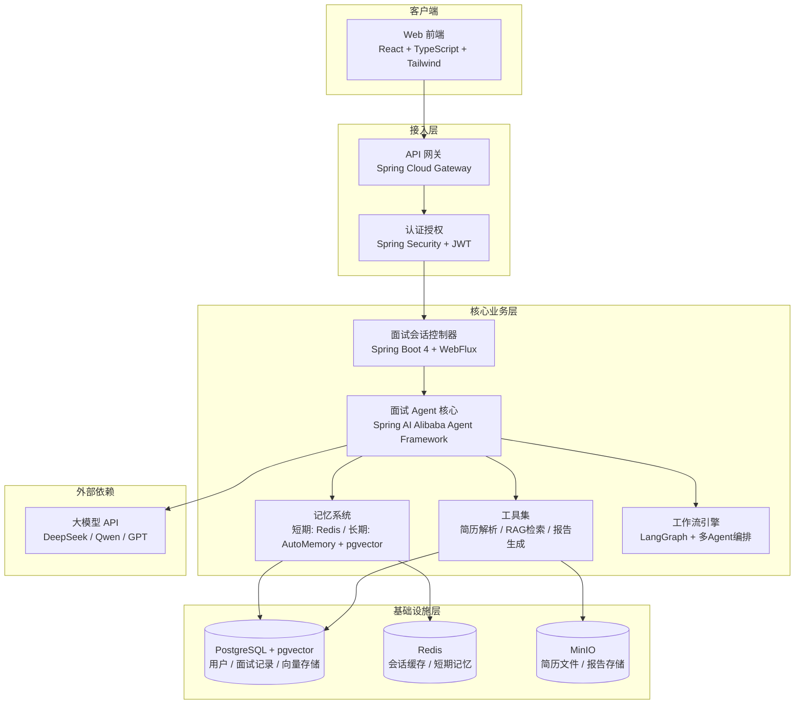
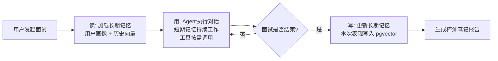

# ☕ JavaCafe / 咖面 —— 项目技术框架文档

> **“用一杯咖啡的时间，搞定一场Java面试。”**

---

## 📋 目录

1. [项目概述](#1-项目概述)
2. [产品设计语言](#2-产品设计语言)
3. [咖啡菜单功能映射](#3-咖啡菜单功能映射)
4. [系统架构图](#4-系统架构图)
5. [技术栈详细清单](#5-技术栈详细清单)
6. [记忆系统核心设计](#6-记忆系统核心设计)
7. [核心功能调用链路](#7-核心功能调用链路)
8. [项目模块结构](#8-项目模块结构)
9. [开发路线图与优先级](#9-开发路线图与优先级)
10. [部署与运维方案](#10-部署与运维方案)

---

## 1. 项目概述

| 项目信息     | 说明                                                         |
| :----------- | :----------------------------------------------------------- |
| **项目名称** | JavaCafe / 咖面                                              |
| **中文名称** | 咖面（咖啡面试智能助手）                                     |
| **核心定位** | 面向 Java 技术岗位的 AI 面试模拟与智能辅导工具               |
| **品牌标语** | “用一杯咖啡的时间，搞定一场 Java 面试。”                     |
| **目标用户** | 准备 Java 技术面试的求职者（校招 / 社招）                    |
| **核心价值** | 通过 AI 驱动的多轮对话与个性化记忆，提供高仿真、低压力的面试演练，并将模糊的面试感受转化为清晰、可执行的改进指南。 |

---

## 2. 产品设计语言

### 🎨 视觉风格

- **主色调**：暖棕色（咖啡色）+ 奶油白 + 活力橙。
- **设计理念**：摒弃传统面试工具的黑白灰冷色调，营造出咖啡馆的温馨与专注氛围。

### 🧩 交互与UI元素

- **加载动画**：旋转的咖啡豆。
- **正向反馈**：回答完一道题，浮现一颗爱心拉花。
- **每日签到**：命名为“每日一杯”。
- **核心按钮**：“开始面试”替换为 **“点单”**。
- **AI人格**：面试官命名为 **“首席咖啡师”**。

---

## 3. 咖啡菜单功能映射

为了让产品更有趣且贴合 Java 程序员群体，核心功能按“咖啡菜单”进行包装：

| 功能模块         | 咖啡命名              | 功能解释                                                     | 实现依赖                  |
| :--------------- | :-------------------- | :----------------------------------------------------------- | :------------------------ |
| **项目深挖模拟** | **手冲（Pour-over）** | 像手冲咖啡一样，对你的简历项目进行缓慢、细致、深度的连环追问。 | 简历解析 Tool、追问工作流 |
| **系统设计面试** | **美式（Americano）** | 思路开阔，架构宏大，考验你的整体技术视野（如高并发、分布式）。 | 系统设计评估 Prompt       |
| **八股文问答**   | **拿铁（Latte）**     | 基础知识的融合与拉花，考查 Java 基础、JVM、并发等知识的熟练度。 | RAG 向量检索 Tool         |
| **综合模拟实战** | **当季特调**          | 随机组合各类题型，全真模拟大厂随机面试流程。                 | 编排 Agent（随机路由）    |
| **错题复盘报告** | **杯测笔记**          | 像咖啡杯测师一样，为你记录每场面试的“风味”优缺点及改进建议。 | 报告生成 Agent            |

---

## 4. 系统架构图



## 5. 技术栈详细清单

### 5.1 后端核心

| 组件             | 技术选型                          | 版本   | 选型理由                                                |
| :--------------- | :-------------------------------- | :----- | :------------------------------------------------------ |
| **基础框架**     | Spring Boot                       | 4.x    | Java 生态标准，稳定成熟，社区庞大。                     |
| **编程语言**     | Java                              | 21 LTS | 利用虚拟线程支持高并发，模式匹配提升开发效率。          |
| **AI/Agent框架** | Spring AI Alibaba Agent Framework | 最新   | 深度集成 Spring，开箱即用的 Agent、记忆与工具调用能力。 |
| **工作流编排**   | LangGraph (Java 适配版)           | -      | 支持复杂的多轮对话状态管理与条件分支。                  |
| **响应式编程**   | Spring WebFlux                    | 4.x    | 支持非阻塞 IO，完美适配 AI 流式输出（打字机效果）。     |

### 5.2 数据与记忆层

| 组件             | 技术选型                   | 用途                                                 |
| :--------------- | :------------------------- | :--------------------------------------------------- |
| **关系数据库**   | PostgreSQL 16+             | 存储用户账号、面试记录、评估报告等结构化数据。       |
| **向量数据库**   | pgvector (PostgreSQL 插件) | 存储面试记录的向量嵌入，用于 RAG 检索历史经验。      |
| **短期记忆缓存** | Redis 7.x                  | 缓存当前会话的对话列表与上下文状态，支持分布式部署。 |
| **对象存储**     | 项目根目录下创建文件夹存储 | 存储用户简历 PDF 及生成的杯测报告。                  |
| **文档解析**     | Apache Tika                | 解析简历（PDF/Word）为纯文本，供 LLM 分析。          |

### 5.3 AI 模型与 RAG

| 组件               | 技术选型                           | 用途                                   |
| :----------------- | :--------------------------------- | :------------------------------------- |
| **大语言模型**     | DeepSeek-V3 / Qwen-Max / GPT-4o    | 核心推理引擎，驱动多轮对话与工具调用。 |
| **Embedding 模型** | text-embedding-v3 / Qwen-embedding | 将面试记录、简历片段向量化。           |
| **RAG 框架**       | Spring AI 向量存储抽象层           | 统一操作 pgvector，实现相似度检索。    |

### 5.4 前端层

| 组件         | 技术选型                 | 用途                                   |
| :----------- | :----------------------- | :------------------------------------- |
| **前端框架** | React 18                 | 构建单页应用，交互流畅。               |
| **类型语言** | TypeScript               | 类型安全，提升代码可维护性。           |
| **样式方案** | Tailwind CSS             | 高效实现“暖棕+奶油+橙”品牌视觉风格。   |
| **状态管理** | Zustand                  | 轻量级状态管理，处理面试会话状态。     |
| **流式通信** | SSE (Server-Sent Events) | 实现 AI 回答的流式输出（打字机效果）。 |

---

## 6. 记忆系统核心设计

记忆是 JavaCafe 的灵魂，采用 **“短期记忆 + 长期记忆”** 分层架构，遵循 **“读 → 用 → 写”** 闭环。

### 6.1 短期记忆 (Short-term Memory)

- **职责**：保证单次面试的流畅与连贯，记住“刚才说了什么”。
- **实现方案**：
  - **基础**：维护对话消息列表，每次请求将历史发送给大模型。
  - **进阶**：对话过长时，采用**滚动摘要**或**结构化任务状态**压缩信息，避免超出上下文窗口。
- **存储**：Spring AI Session + Redis（支持分布式会话）。

### 6.2 长期记忆 (Long-term Memory)

- **职责**：实现跨会话的个性化，记住“你是谁”，越用越了解你。
- **实现方案**：
  1.  **用户画像（实体记忆）**：提取用户的固定属性（如“精通 Java 并发”、“求职目标：后端架构”）为结构化数据，每次面试前注入系统提示词。
  2.  **历史经验（向量记忆）**：每次面试的完整记录通过 Embedding 模型向量化后存入 **pgvector**。下次面试时，系统根据当前问题检索最相关的历史记录作为参考。

### 6.3 “读 → 用 → 写” 闭环



## 7. 核心功能调用链路

### 7.1 功能菜单与后台映射

| 前端菜单（咖啡名）   | Controller 路由            | 核心 Agent/Tool                          | 关键 Prompt 文件      |
| :------------------- | :------------------------- | :--------------------------------------- | :-------------------- |
| **手冲（项目深挖）** | `/api/interview/pour-over` | `ResumeParsingTool` + `DeepDiveWorkflow` | `PourOverPrompt.txt`  |
| **美式（系统设计）** | `/api/interview/americano` | `SystemDesignEvaluator`                  | `AmericanoPrompt.txt` |
| **拿铁（八股文）**   | `/api/interview/latte`     | `VectorRetrievalTool` (RAG)              | `LattePrompt.txt`     |
| **当季特调（综合）** | `/api/interview/special`   | `InterviewOrchestrator`                  | `SpecialPrompt.txt`   |

### 7.2 以“手冲（项目深挖）”为例的调用链

```text
用户点击 [手冲] 
    → Controller 接收请求并鉴权 
    → Agent 初始化，加载 PourOverPrompt.txt 
    → 调用 ResumeParsingTool 解析用户简历（读取 MinIO）
    → 调用 LongTermMemory 检索该用户历史薄弱点（读取 pgvector）
    → 进入 DeepDiveWorkflow（LangGraph 状态图）：
        ├─ 节点 A: 基于简历提问
        ├─ 节点 B: 判断回答深度（若肤浅则循环追问，若详实则推进）
        └─ 节点 C: 总结该话题
    → 面试结束触发 ReportGeneratorTool
    → 写入 LongTermMemory（更新 pgvector）
    → 返回流式 SSE 结果至前端
```

## 8. 项目模块结构

```text
javacafe/
├── javacafe-api/                    # API 定义模块（DTO、接口契约）
├── javacafe-common/                 # 公共工具类、业务常量、自定义异常
├── javacafe-core/                   # 核心业务模块
│   ├── agent/                       # Agent 核心
│   │   ├── InterviewAgent.java      # 主面试 Agent
│   │   ├── AgentConfig.java         # Agent 配置（模型、温度等）
│   │   └── MemoryManager.java       # 记忆管理（读写协调）
│   ├── tools/                       # 工具集（对应咖啡菜单）
│   │   ├── ResumeParsingTool.java   # 简历解析
│   │   ├── VectorRetrievalTool.java # RAG 向量检索
│   │   ├── SystemDesignEvaluator.java # 系统设计评估
│   │   └── ReportGeneratorTool.java # 杯测报告生成
│   ├── workflow/                    # 工作流编排
│   │   ├── DeepDiveWorkflow.java    # 手冲（项目深挖）工作流
│   │   ├── InterviewOrchestrator.java # 当季特调（综合编排）
│   │   └── StateGraphBuilder.java   # LangGraph 状态图构建器
│   └── prompt/                      # 提示词管理（外部化）
│       ├── PourOverPrompt.txt
│       ├── AmericanoPrompt.txt
│       ├── LattePrompt.txt
│       └── SpecialPrompt.txt
├── javacafe-infrastructure/         # 基础设施层
│   ├── config/                      # 配置类（Redis、PG、MinIO）
│   ├── repository/                  # 数据访问层（Spring JPA + pgvector）
│   └── memory/                      # 记忆实现
│       ├── ShortTermMemory.java     # 基于 Redis 的短期记忆
│       └── LongTermMemory.java      # 基于 pgvector 的长期记忆
├── javacafe-web/                    # Web 接入层
│   ├── controller/                  # REST API 控制器
│   ├── filter/                      # 认证与日志过滤器
│   ├── handler/                     # SSE 流式处理器
│   └── dto/                         # 请求/响应对象
└── javacafe-assembly/               # 打包与部署配置
    ├── docker-compose.yml           # 容器编排文件
    ├── Dockerfile                   # 应用镜像构建
    └── application.yml              # 多环境配置文件
```

## 9. 开发路线图与优先级

建议按以下优先级迭代开发，以最快速度验证核心价值：

| 优先级   | 模块/功能                            | 预估工时     | 交付目标                                   |
| :------- | :----------------------------------- | :----------- | :----------------------------------------- |
| **P0**   | 基础会话 + 短期记忆 + 拿铁（八股文） | 2 天         | 跑通完整对话流，验证模型基础问答能力。     |
| **P1**   | 简历解析 + 手冲（项目深挖工作流）    | 3 天         | 实现核心差异化价值（基于真实简历的深挖）。 |
| **P2**   | 美式（系统设计评估）+ 长期记忆存储   | 2 天         | 增强覆盖面，实现跨会话个性化。             |
| **P3**   | 当季特调（综合模拟编排）             | 2 天         | 实现多题型随机组合与路由。                 |
| **P4**   | 杯测报告（可视化）+ 前端视觉打磨     | 2 天         | 完善用户体验，交付完整闭环。               |
| **总计** |                                      | **约 11 天** | 交付最小可行产品 (MVP)。                   |

### 里程碑检查点

| 里程碑             | 时间节点     | 验收标准                                 |
| :----------------- | :----------- | :--------------------------------------- |
| **M1: 骨架搭建**   | 第 2 天结束  | SSE流式对话可用，拿铁模式能正常问答。    |
| **M2: 核心差异化** | 第 5 天结束  | 简历解析 + 项目深挖工作流完整跑通。      |
| **M3: 个性化增强** | 第 7 天结束  | 长期记忆读写正常，跨会话可见个性化效果。 |
| **M4: 全功能集成** | 第 9 天结束  | 四种模式可切换，综合模拟随机路由正常。   |
| **M5: 产品交付**   | 第 11 天结束 | 完整 UI + 杯测报告 + 部署就绪。          |

## 10. 本地运行与开发指南（无 Docker）

本方案不依赖 Docker，所有基础设施需在本地手动安装并配置。

### 10.1 前置环境要求

| 组件           | 版本要求                         | 说明                                  |
| :------------- | :------------------------------- | :------------------------------------ |
| **JDK**        | 21 LTS                           | 必须使用 Java 21 以支持虚拟线程特性。 |
| **Maven**      | 3.9+                             | 项目构建工具。                        |
| **PostgreSQL** | 16+                              | 需安装 `pgvector` 扩展。              |
| **Redis**      | 7.x                              | 用于短期记忆缓存。                    |
| **Node.js**    | 18+                              | （可选）前端开发环境。                |
| **IDE**        | IntelliJ IDEA 2023.3+ 或 VS Code | 推荐 IDEA。                           |

### 10.2 数据库初始化

安装并启动 PostgreSQL 16+（含 pgvector 扩展）和 Redis 7.x 后，执行以下 SQL 创建数据库：

```sql
CREATE DATABASE javacafe;
```

### 10.3 本地文件存储

在项目根目录下创建以下文件夹用于存储简历和报告：

```
mkdir -p ./data/resumes
mkdir -p ./data/reports
```

### 10.4 应用配置文件（application-local.yml）

在 `javacafe-web/src/main/resources/` 目录下创建 `application-local.yml` 文件：

```yaml
spring:
  datasource:
    url: jdbc:postgresql://localhost:5432/javacafe
    username: postgres
    password: your_password
  redis:
    host: localhost
    port: 6379

# 大模型配置
llm:
  provider: deepseek
  api-key: sk-xxxxxxxxxxxxxxxxxxxxxxxx
  model: deepseek-v3
  base-url: https://api.deepseek.com

# 本地文件存储配置
storage:
  type: local
  local:
    base-path: ./data
    resume-dir: resumes
    report-dir: reports

# 日志级别
logging:
  level:
    com.javacafe: DEBUG
    org.springframework.ai: DEBUG
```

### 10.5 启动后端服务

**方式一：IDEA 直接运行**

在 IntelliJ IDEA 中打开项目，选择 `javacafe-web` 模块的 `Application.java`，配置 Active Profile 为 `local`，然后点击 Run。

**方式二：Maven 命令行运行**

```
cd javacafe
mvn clean install -DskipTests
cd javacafe-web
mvn spring-boot:run -Dspring-boot.run.profiles=local
```

### 10.6 启动前端（可选）独立前端项目：


```
cd javacafe-frontend
npm install
npm run dev
```

前端默认访问 `http://localhost:5173`，代理后端 API 至 `http://localhost:8080`。